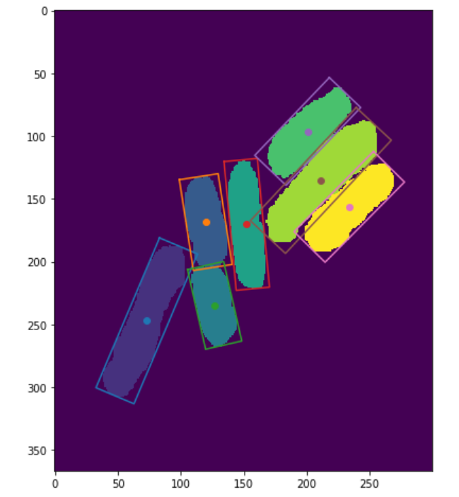

# `np_obb` calculate oriented bounding boxes in python

## About
`np_obb` is a python package to calculate oriented bounding boxes from:
* mask images (boolean numpy arrays)
* label images (integer numpy arrays labeling connected components)
* point lists



Author: Volker Hilsenstein based on a [stackoverflow post by 
Mario Klingemann](https://stackoverflow.com/questions/32892932/create-the-oriented-bounding-box-obb-with-python-and-numpy).

## Installation

Install directly from this repo using:
```
pip install git+https://github.com/VolkerH/np_obb.git
```

## Usage

See the examples in [the Jupyter notebook in the `example` folder](./example/Oriented%20Bounding%20Boxes%20Examples.ipynb).

## Limitations

This implementation uses the approach of finding the dominant orientation of the object using the covariance or eigenvectors.
This works extremely well for elongated objects such as the ones in the sample image but may not be optimal for more symmetric objects. An optimal algorithm should search for the smallest (in area or volume) oriented box that fits the whole object. Such an optimization does not necessarily have a unique solution, just think of the degenrate case of a perfectly symmetric object such as a circle.
Also see the discussion in [this stackoverflow post](https://stackoverflow.com/questions/6189229/creating-oobb-from-points).
